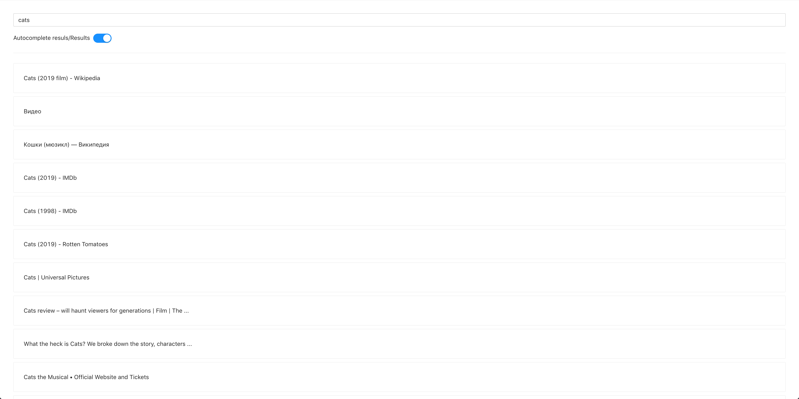
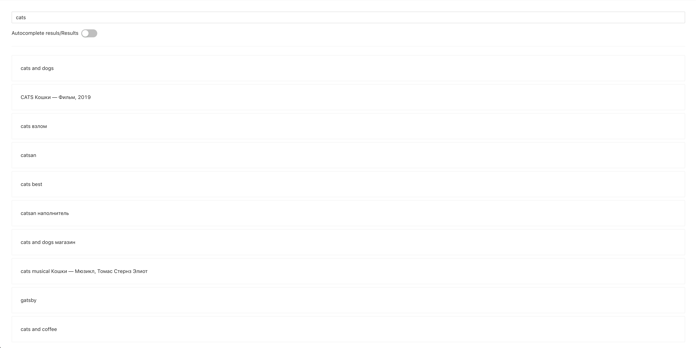

# Frontend for google keywords scrapping

Use with [backend](https://github.com/kamtim/simple-keyword-scrapper)
by running it locally in advance

___

## Examples

I use text `cats` for example

Results 

Autocomplete results

